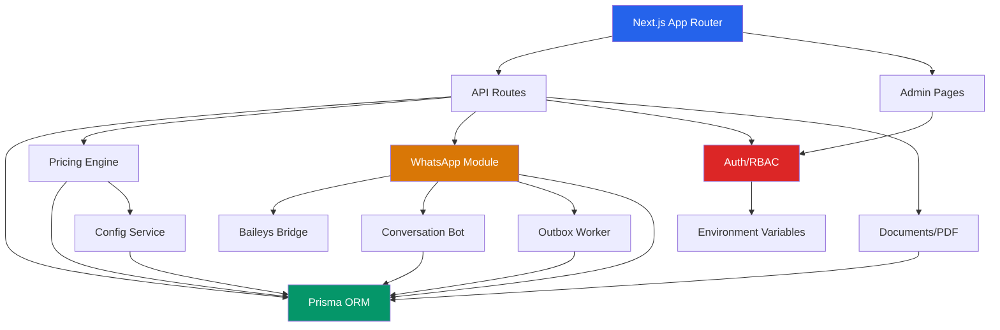

# Auditoria Completa - MAdef (Mãos Amigas)

**Data:** 2026-02-21
**Escopo:** Análise end-to-end de arquitetura, segurança, qualidade de código e débito técnico
**Repositório:** smil3nirvan4-cmd/MAdef

---

## 1. Visão Geral do Sistema

**Tipo:** Plataforma de gestão de cuidadores domiciliares e hospitalares
**Stack:** Next.js 16 (App Router) + TypeScript + Prisma (SQLite) + Baileys (WhatsApp)
**Módulos principais:**

| Módulo | Diretório | Descrição |
|--------|-----------|-----------|
| Admin Dashboard | `src/app/admin/` | Painel com 15+ páginas (leads, pacientes, avaliações, orçamentos, etc.) |
| API Routes | `src/app/api/` | ~40 rotas REST (admin, WhatsApp, orçamento, auth) |
| Pricing Engine | `src/lib/pricing/` | Motor de precificação dual (legado + enterprise) |
| WhatsApp Bot | `src/lib/whatsapp/` | Chatbot conversacional + bridge com Baileys |
| Auth/RBAC | `src/lib/auth/` | Sistema de roles com 6 perfis e ~20 capabilities |
| Evaluations | `src/lib/evaluation/` | Escalas ABEMID, Katz, Lawton |
| Documents | `src/lib/documents/` | Geração de PDFs (propostas, contratos) |
| Observability | `src/lib/observability/` | Logger estruturado + request context |

---

## 2. Achados Críticos (CORRIGIDOS nesta auditoria)

### 2.1 [CRITICO] Comparação de senha em plaintext — `src/auth.ts:27`

**Antes:** `email === ADMIN_EMAIL && password === ADMIN_PASSWORD`
**Problema:** Comparação direta de strings é vulnerável a timing attacks. Um atacante pode medir o tempo de resposta para inferir caracteres corretos da senha.
**Correção aplicada:** Substituído por `crypto.timingSafeEqual()` com buffer de tamanho constante.

### 2.2 [CRITICO] Arquivos de sessão WhatsApp no git

**Arquivos expostos:**
- `auth_info/` — Contém chaves de autenticação do WhatsApp
- `.wa-session.json` — Estado da sessão com dados sensíveis
- `.wa-state.json` — Estado interno do bridge
- `.wa-automation-settings.json` — Configurações de automação

**Correção aplicada:** Adicionados ao `.gitignore`. **AÇÃO PENDENTE:** Executar `git rm --cached` para remover do histórico (requer `git filter-branch` ou BFG para limpeza completa do histórico).

### 2.3 [CRITICO] Build artifacts commitados

**Arquivos:** `build-full.log`, `build-log.txt`, `build-output.txt`, `lint_output.txt`, `tsc-errors.txt`, `ui_output.html`, `inspect-db.ts`
**Risco:** Exposição de paths internos, erros de compilação e estrutura do banco.
**Correção aplicada:** Adicionados ao `.gitignore`.

### 2.4 [ALTO] Rate limiting duplicado no webhook

**Antes:** `src/app/api/whatsapp/webhook/route.ts` implementava rate limiting próprio (Map local) ignorando `src/lib/api/rate-limit.ts` que já existia.
**Correção aplicada:** Refatorado para usar o módulo compartilhado `checkRateLimit` + `getClientIp`.

### 2.5 [ALTO] `any` type no payload do webhook

**Antes:** `let body: any` no handler do webhook.
**Correção aplicada:** Tipado como `Record<string, unknown>` com validação de estrutura (rejeita arrays e primitivos).

### 2.6 [ALTO] ESLint com regras críticas desativadas

**Antes:** `react-hooks/rules-of-hooks: "warn"` e `@typescript-eslint/no-unused-vars: "off"`.
**Correção aplicada:**
- `rules-of-hooks` → `"error"` (violações de hooks são bugs, não warnings)
- `no-unused-vars` → `["warn", { argsIgnorePattern: "^_" }]` (detecta variáveis mortas mas permite convenção `_`)

### 2.7 [MEDIO] Falta de `.env.example`

**Correção aplicada:** Criado `.env.example` documentando todas as 35 variáveis de ambiente encontradas no código.

### 2.8 [MEDIO] CI/CD incompleto

**Correção aplicada:**
- Adicionado `prisma generate` antes do type check
- Adicionada etapa de `npm audit`
- Adicionada concurrency control para evitar builds duplicados
- Incluído branch `master` nos triggers

---

## 3. Achados Pendentes (Requerem Ação Futura)

### 3.1 [CRITICO] SQLite em produção

**Arquivo:** `prisma/schema.prisma:5` — `provider = "sqlite"`
**Problema:** SQLite não suporta:
- Acesso concorrente de escrita (write lock global)
- Multi-instance deployment
- Backups online sem risco de corrupção
- Full-text search performática

**Recomendação:** Migrar para PostgreSQL. O Prisma torna isso viável com mudança mínima:
1. Alterar provider para `postgresql`
2. Substituir campos `String` que armazenam JSON por `Json` nativo
3. Ajustar `@default(cuid())` para `@default(uuid())` se preferível
4. Remover `file:./dev.db` e configurar connection string PostgreSQL

### 3.2 [CRITICO] Usuários definidos por variáveis de ambiente

**Arquivo:** `src/lib/auth/roles.ts:136-153`
**Problema:** `resolveUserRole()` lê emails de env vars (`ADMIN_EMAILS`, `SUPERVISOR_EMAILS`, etc.) em toda requisição. Não existe:
- CRUD de usuários
- Hashing de senhas por usuário
- Registro de novos usuários
- Bloqueio após tentativas falhas

**Recomendação:** Criar modelo `User` no Prisma com:
```prisma
model User {
  id           String    @id @default(cuid())
  email        String    @unique
  passwordHash String
  role         String    @default("LEITURA")
  isActive     Boolean   @default(true)
  lastLoginAt  DateTime?
  failedLogins Int       @default(0)
  lockedUntil  DateTime?
  createdAt    DateTime  @default(now())
  updatedAt    DateTime  @updatedAt
}
```

### 3.3 [ALTO] Rate limiting in-memory

**Arquivo:** `src/lib/api/rate-limit.ts:6` — `const store = new Map<string, RateLimitRecord>()`
**Problema:** O Map é perdido em cada restart e não compartilhado entre instâncias.
**Recomendação:** Usar Redis ou o próprio banco com window sliding.

### 3.4 [ALTO] Componentes de página monolíticos

**Arquivos afetados:**
| Arquivo | Tamanho | LOC estimado |
|---------|---------|--------------|
| `src/app/admin/avaliacoes/nova/page.tsx` | 106 KB | ~2500 |
| `src/app/admin/orcamentos/[id]/page.tsx` | 64 KB | ~1500 |
| `src/app/admin/leads/[id]/page.tsx` | 36 KB | ~800 |
| `src/app/admin/orcamentos/novo/page.tsx` | 30 KB | ~700 |

**Problema:** Estes arquivos são difíceis de manter, testar e revisar. Um único componente com 2500 linhas viola SRP.
**Recomendação:** Extrair para componentes menores:
- `AvaliacaoNovaPage` → `AvaliacaoForm`, `AvaliacaoStepWizard`, `AvaliacaoReview`
- `OrcamentoDetailPage` → `OrcamentoHeader`, `OrcamentoPricing`, `OrcamentoTimeline`

### 3.5 [ALTO] Campos JSON stringificados no Prisma

**Campos afetados:** `dadosDetalhados`, `cenarioEconomico`, `snapshotInput`, `snapshotOutput`, `planningInput`, `normalizedSchedule`, `pricingBreakdown`, `dados` (FormSubmission), `metadata` (SystemLog), etc.
**Problema:** Todos são `String` com `JSON.stringify()` manual. Sem validação de schema, sem query capabilities, sem type safety na leitura.
**Recomendação:** Com PostgreSQL, usar tipo `Json` nativo do Prisma. Com SQLite, criar schemas Zod para validar na escrita e leitura.

### 3.6 [MEDIO] Dual pricing engine sem flag de deprecação

**Arquivo:** `src/lib/pricing/calculator.ts`
**Problema:** O arquivo contém DOIS sistemas de pricing:
1. `calcularOrcamento()` (legado, linhas 150-319) — hardcoded values, sem config DB
2. `calculateEnterprisePricing()` (enterprise, linhas 473-648) — config-driven

O sistema enterprise já funciona, mas o legado é mantido como fallback sem timeline de remoção.
**Recomendação:** Marcar `calcularOrcamento` e `calcularOrcamentoCenarios` como `@deprecated` e definir data de remoção.

### 3.7 [MEDIO] Sem database migrations

**Arquivo:** `package.json:22` — `"db:push": "prisma db push"`
**Problema:** `db push` é para prototyping. Em produção, alterações de schema devem usar `prisma migrate` para:
- Reversibilidade
- Histórico de alterações
- Deployments seguros

**Recomendação:** `npx prisma migrate dev --name init` para criar a primeira migration, depois usar `migrate deploy` em CI.

### 3.8 [MEDIO] Sem LGPD/GDPR compliance

**Dados sensíveis armazenados sem:**
- Mecanismo de exclusão de dados pessoais (right to deletion)
- Consent tracking
- Data retention policies
- Audit trail de acesso a dados pessoais

**Modelos afetados:** `Paciente`, `Cuidador`, `Mensagem`, `WhatsAppContact`, `WhatsAppMessage`

### 3.9 [BAIXO] Mix de idiomas no código

**Padrão inconsistente:**
- Modelos Prisma: Português (`Paciente`, `Cuidador`, `Avaliacao`)
- Enterprise engine: Inglês (`calculateEnterprisePricing`, `PricingConfigSnapshot`)
- API responses: Mix (`valorHora`, `finalPrice`, `configVersionId`)

**Recomendação:** Definir política: Modelos e UI em português (domínio brasileiro), lógica e API em inglês. Documentar no README.

---

## 4. Mapa de Cobertura de Testes

**Total de arquivos de teste:** 34

| Módulo | Testes | Cobertura |
|--------|--------|-----------|
| `lib/pricing/` | 6 arquivos | Alta (calculator, enterprise-engine, coverage-presets, input-hash, planning-estimator) |
| `lib/whatsapp/` | 7 arquivos | Média (circuit-breaker, conversation-bot, webhook-security, outbox/*, admin-tabs, provider-message-id) |
| `lib/auth/` | 2 arquivos | Média (roles, capability-guard) |
| `lib/api/` | 2 arquivos | Baixa (query-params, rate-limit) |
| `lib/documents/` | 3 arquivos | Média (build-pdf-data, commercial-message, send-options) |
| `lib/evaluation/` | 1 arquivo | Baixa (apenas abemid, faltam katz e lawton) |
| `lib/enterprise/` | 2 arquivos | Boa (config-engine, feature-flags) |
| `lib/contracts/` | 1 arquivo | Baixa (template-engine) |
| `app/api/` | 5 arquivos | Baixa (apenas avaliacoes/[id], orcamento) |
| `app/admin/` | 0 arquivos | Nenhuma |
| `components/` | 0 arquivos | Nenhuma |

**Lacunas críticas:**
- Zero testes de componentes React
- Zero testes de integração E2E
- `katz.ts` e `lawton.ts` sem testes unitários
- Nenhuma rota API de WhatsApp admin testada

---

## 5. Diagrama de Dependências



---

## 6. Score de Maturidade por Módulo

| Módulo | Score (1-5) | Justificativa |
|--------|:-----------:|---------------|
| Pricing Engine | 4 | Bem tipado, testado, dual-mode com fallback |
| Auth/RBAC | 3 | Funcional mas env-based, sem user management |
| WhatsApp Bot | 3 | Conversation flow completo, circuit breaker, mas `any` types |
| API Layer | 3 | Response helpers, request context, rate limit — mas inconsistente |
| Observability | 3 | Logger estruturado, request IDs — falta métricas |
| Admin UI | 2 | Funcional mas monolítico, sem testes, componentes gigantes |
| Enterprise Config | 4 | Versionamento, multi-unidade, audit logs |
| Database | 2 | SQLite, sem migrations, JSON em strings |
| CI/CD | 2 | Pipeline básico, sem security scanning, sem deploy |
| Documentation | 2 | README básico, sem API docs, sem onboarding guide |

---

## 7. Resumo das Correções Implementadas

| # | Severidade | Descrição | Arquivo(s) |
|---|:----------:|-----------|------------|
| 1 | CRITICO | Timing-safe password comparison | `src/auth.ts` |
| 2 | CRITICO | Session files added to .gitignore | `.gitignore` |
| 3 | CRITICO | Build artifacts added to .gitignore | `.gitignore` |
| 4 | ALTO | Deduplicated rate limiting in webhook | `src/app/api/whatsapp/webhook/route.ts` |
| 5 | ALTO | Typed webhook payload (removed `any`) | `src/app/api/whatsapp/webhook/route.ts` |
| 6 | ALTO | Re-enabled critical ESLint rules | `eslint.config.mjs` |
| 7 | MEDIO | Created .env.example (35 vars) | `.env.example` |
| 8 | MEDIO | Added error boundary utility | `src/lib/api/with-error-boundary.ts` |
| 9 | MEDIO | Improved CI pipeline | `.github/workflows/ci.yml` |
| 10 | BAIXO | Fixed `any` cast in session callback | `src/auth.ts` |

---

## 8. Roadmap de Próximos Passos (Priorizado)

### Fase 1 — Segurança (Prioridade Imediata)
- [ ] Executar `git rm --cached` nos arquivos sensíveis já commitados
- [ ] Migrar auth para modelo User no banco com bcrypt
- [ ] Implementar rate limiting com Redis
- [ ] Adicionar CORS headers explícitos em todas API routes
- [ ] Implementar CSP (Content Security Policy)

### Fase 2 — Banco de Dados
- [ ] Migrar SQLite → PostgreSQL
- [ ] Converter campos JSON `String` para tipo `Json` nativo
- [ ] Implementar `prisma migrate` ao invés de `db push`
- [ ] Adicionar backups automatizados

### Fase 3 — Qualidade de Código
- [ ] Extrair componentes de páginas >500 LOC
- [ ] Adicionar testes para katz.ts e lawton.ts
- [ ] Adicionar testes de componentes com React Testing Library
- [ ] Deprecar `calcularOrcamento()` com timeline
- [ ] Resolver todos os `any` types restantes

### Fase 4 — Compliance
- [ ] Implementar endpoint de exclusão de dados (LGPD Art. 18)
- [ ] Adicionar consent tracking no cadastro de pacientes
- [ ] Definir data retention policies
- [ ] Documentar fluxos de dados pessoais

### Fase 5 — Operações
- [ ] Adicionar Docker/docker-compose para dev
- [ ] Implementar deploy automatizado (Vercel/Cloud Run)
- [ ] Adicionar monitoring (uptime, error rates)
- [ ] Implementar log rotation para SystemLog
