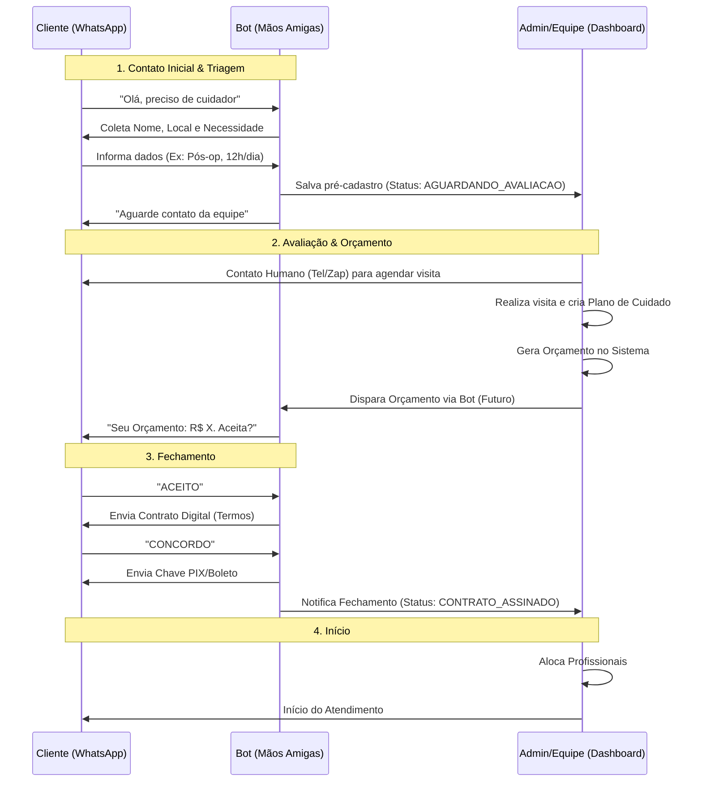

# 🏥 Jornada do Cliente: Do Contato ao Contrato

Este documento detalha o fluxo completo automatizado e manual para a contratação de cuidados.

## 🔄 Diagrama de Fluxo

## 📝 Detalhamento das Etapas

### 1. Triagem Automática (Bot)
- **Objetivo:** Qualificar o lead e entender a urgência.
- **Dados Coletados:** Nome, Localização, Tipo de Paciente (Idoso, Pós-Op), Carga Horária.
- **Resultado:** Lead salvo no sistema como `AGUARDANDO_AVALIACAO`.
- **Ação Humana:** Nenhuma necessária neste momento.

### 2. Avaliação Técnica (Humana)
- **Status:** `AGUARDANDO_AVALIACAO`
- **Ação:** Enfermeira responsável acessa o Painel Admin, vê o lead e entra em contato.
- **Visita:** Avaliação presencial do paciente para definir complexidade.

### 3. Negociação (Híbrido)
- **Ação:** Admin cria o orçamento no sistema.
- **Envio:** O Admin pode enviar o PDF por email ou o Bot pode enviar um resumo.
- **Interação:** O Cliente pode ACEITAR ou RECUSAR via WhatsApp.
    - Se RECUSAR: Bot pergunta motivo e notifica consultor.
    - Se ACEITAR: Bot avança para contrato.

### 4. Assinatura Digital (Bot)
- **Status:** `AGUARDANDO_ASSINATURA`
- **Fluxo:** O Bot apresenta os termos legais resumidos.
- **Validade:** O "CONCORDO" via WhatsApp, atrelado ao número de telefone verificado, tem validade jurídica como aceite eletrônico em muitos contextos (similar a email).
- **Resultado:** Status muda para `AGUARDANDO_PAGAMENTO`.

## 🚀 Próximos Passos de Desenvolvimento
Para fechar o ciclo 100% via sistema, precisamos implementar:
1. **Botão "Enviar Orçamento" no Admin:** Que dispara a mensagem de template para o cliente aceitar.
2. **Integração PIX:** Para o bot gerar o QR Code automaticamente após a assinatura.
